## 🤔 Who am I?

```php
<?php

class SoftwareEngineer
{
    private string $name;
    private string $role;
    private array $focus;

    public function __construct()
    {
        $this->name = "Vitor Paloco";
        $this->role = "Full Stack Developer";
    }

    public function sayHi(): void
    {
        echo "Thanks for dropping by, hope you find some of my work interesting.";
    }
}

$me = new SoftwareEngineer();
$me->sayHi();
```

## ⚙️ Technologies & Tools

<p align="center"> 
     &nbsp;&nbsp;&nbsp; 
     
</p>

<br>

<table width="100%" align="center">
  <tr>
    <th colspan="9" align="center"> Tools </th>
  </tr>
    
  <tr>
    <td width="11.11%" align="center">
      <a href="#">
        
      </a>
      <br>
      <strong>Docker</strong>
    </td>
    <td width="11.11%" align="center">
      <a href="#">
        
      </a>
      <br>
      <strong>ProxMox</strong>
    </td>
    <td width="11.11%" align="center">
      <a href="#">
        
      </a>
      <br>
      <strong>AWS</strong>
    </td>
    <td width="11.11%" align="center">
      <a href="#">
        
      </a>
      <br>
      <strong>Cloudflare</strong>
    </td>
    <td width="11.11%" align="center">
      <a href="#">
        
      </a>
      <br>
      <strong>Porkbun</strong>
    </td>
    <td width="11.11%" align="center">
      <a href="#">
        
      </a>
      <br>
      <strong>Vercel</strong>
    </td>
    <td width="11.11%" align="center">
      <a href="#">
        
      </a>
      <br>
      <strong>SAP</strong>
    </td>
    <td width="11.11%" align="center">
      <a href="#">
        
      </a>
      <br>
      <strong>DBeaver</strong>
    </td>
    <td width="11.11%" align="center">
      <a href="#">
        
      </a>
      <br>
      <strong>n8n</strong>
    </td>
  </tr>

  <tr>
    <td width="11.11%" align="center">
      <a href="#">
        
      </a>
      <br>
      <strong>WireGuard</strong>
    </td>
    <td width="11.11%" align="center">
      <a href="#">
        
      </a>
      <br>
      <strong>TrueNAS</strong>
    </td>
    <td width="11.11%" align="center">
      <a href="#">
        
      </a>
      <br>
      <strong>Figma</strong>
    </td>
    <td width="11.11%" align="center">
      <a href="#">
        
      </a>
      <br>
      <strong>Trello</strong>
    </td>
    <td width="11.11%" align="center">
      <a href="#">
        
      </a>
      <br>
      <strong>ChatGPT</strong>
    </td>
    <td width="11.11%" align="center">
      <a href="#">
        
      </a>
      <br>
      <strong>Ubuntu</strong>
    </td>
    <td width="11.11%" align="center">
      <a href="#">
        
      </a>
      <br>
      <strong>GitHub</strong>
    </td>
    <td width="11.11%" align="center">
      <a href="#">
        
      </a>
      <br>
      <strong>Postman</strong>
    </td>
    <td width="11.11%" align="center">
      <a href="#">
        
      </a>
      <br>
      <strong>Nginx</strong>
    </td>
  </tr>
</table>

<br>

## 📚 Learning

```python
current = {
    "AWS": "studying",
    "Servers & Infrastructure": "studying",
    "Django + Python": "exploring",
}

for subject, status in current.items():
    print(f"{subject:<25} [{status}]")
```

```text
AWS                      [studying]
Servers & Infrastructure [studying]
Django + Python          [exploring]
```

<br>



<p align="center">
  <a href="https://linkedin.com/in/vitor-paloco">
    
  </a>
  &nbsp;
  <a href="https://vitorpaloco.com">
    
  </a>
  &nbsp;
  <a href="mailto:vpaloco.contato@gmail.com">
    
  </a>
</p>

